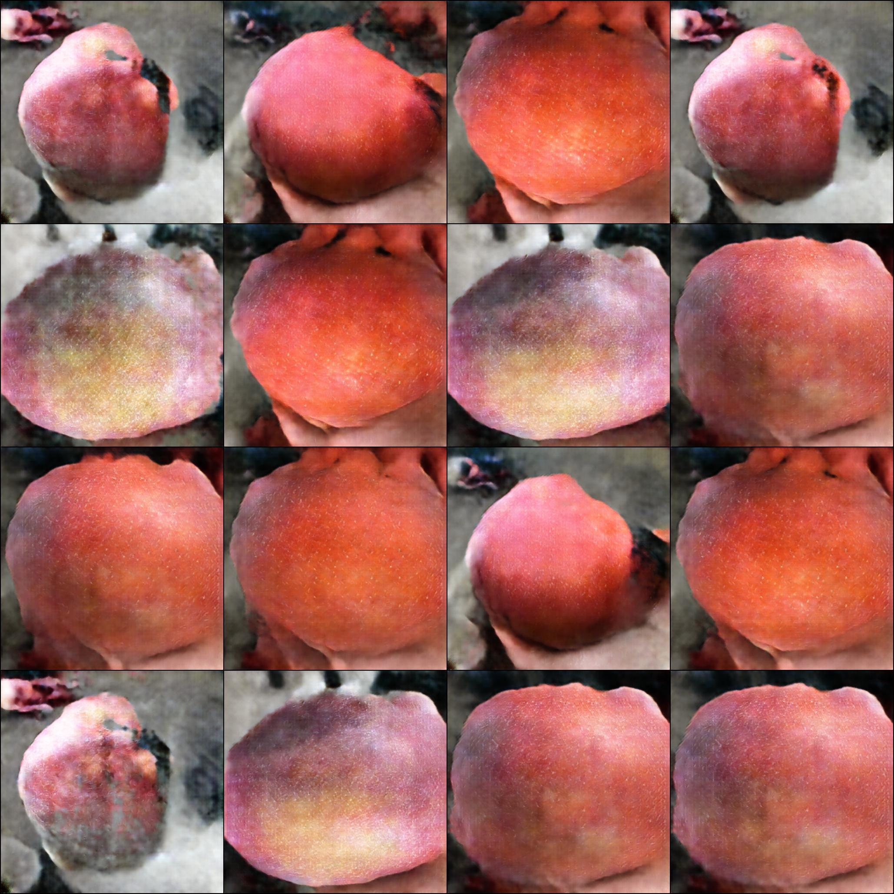

# AI 2020 Competition - Irwin Mango Defects Classification
```
Apply VGG, CNN, Deep Learning, DCGAN model 
for mango grade-classifier and regconition
```
<div align=center></div>

## Introduction
```
A project applying Deep Learning, Machine Learning, GAN 
by python and packages such as Tensorflow and Keras 
Run on Jupyter Notebook, Anaconda and Google Colab GPU.
```

## Method
```
DCGAN : Data Augmentation Using Pytorch backend.
Deep Learning Classifier : CNN & VGG Using Tensorflow and Keras backend.
Machine Learning : Ensemble Learning
```
## GAN (Generative Adversarial Network)
* A model to Generate more images 
```
To optimize the accuracy of mango image classifier
, I use GAN to generate more images for traning model of better efficacy.
```
<div align=center></div>

## Workflow Summary
```
Mounting -> Basic I/O and labeling
-> Classifier 1 -> Reading Demo Image
-> Classifier 2 -> Classifier 3 -> Ensemble learning
-> Reading GAN A/B/C to train models 1, 2 and 3 (optional)
The output of the labeling process: filenames and the grades of the mangoes presented in Capitalized letters.
```
<div align=center></div>

## Results and Accuracy
```
F1 Score = 0.78
```


